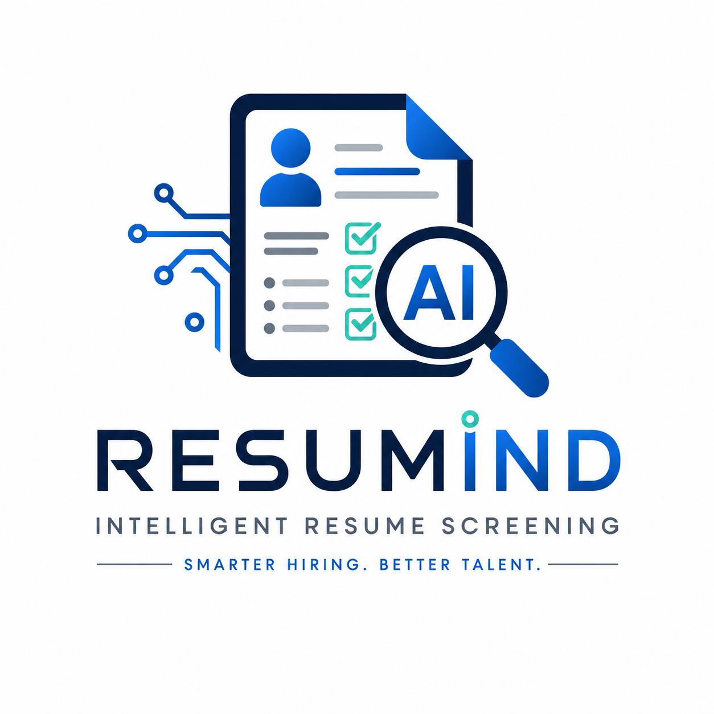

#   AI Resume Screening System

<p align="center">
  
</p>

<p align="center">
  
  
  
  
</p>

> **An AI-powered resume screening platform that automatically analyzes resumes, extracts skills, matches them with job descriptions, and ranks candidates using Natural Language Processing (NLP).**

---

##  Features

✅ Upload multiple resumes (PDF)

✅ Upload a Job Description

✅ Automatic Resume Parsing

✅ NLP-based Skill Extraction

✅ Resume & JD Similarity Matching

✅ Candidate Ranking

✅ Interactive Dashboard

✅ Match Score Visualization

---

## 🛠 Tech Stack

| Technology | Purpose |
|------------|---------|
| Python | Backend |
| Streamlit | Web Interface |
| spaCy | NLP |
| Scikit-learn | Similarity Matching |
| Pandas | Data Processing |
| Plotly | Visualizations |
| PyMuPDF | PDF Parsing |
| NLTK | Text Processing |

---

## 📂 Project Structure

```text
AI-Resume-Screening-System/
├── app.py
├── requirements.txt
├── assets/
├── src/
└── README.md
```

---

## ⚙️ Installation

```bash
git clone https://github.com/ANANDHU-BIJU/AI-Resume-Screening-System.git 

cd AI-Resume-Screening-System

pip install -r requirements.txt

streamlit run app.py
```

---

## 📈 Workflow

```text
Resume Upload
      │
      ▼
Resume Parsing
      │
      ▼
Skill Extraction
      │
      ▼
Job Description Analysis
      │
      ▼
Similarity Matching
      │
      ▼
Candidate Ranking
      │
      ▼
Results Dashboard
```

---

## 🎯 Future Enhancements

- 🤖 LLM-powered candidate evaluation
- 📄 OCR support for scanned resumes
- 💬 AI-generated interview questions
- 📊 Analytics dashboard
- 🔐 User authentication

---

## 👨‍💻 Author

**Anandhu Biju**

⭐ If you like this project, don't forget to star the repository!
